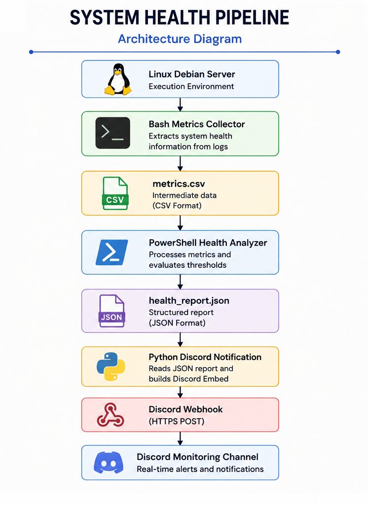
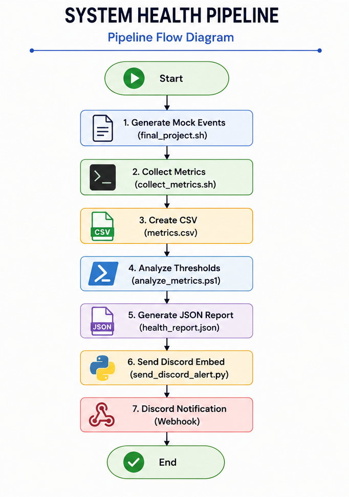

# System Health Pipeline

**Author:** Yatzaré Hernández

---


## Overview

System Health Pipeline is a modular monitoring solution developed to automate the collection, processing and notification of system health events in Linux environments.

The project combines Bash, PowerShell and Python to simulate system telemetry, analyze resource utilization, generate structured JSON reports and deliver real-time notifications to Discord using Webhooks.

This implementation follows a multi-stage pipeline architecture where each technology performs a specific responsbility, improving modularity, maintainability and scalability.

---


## Main Features

- Automated system event simulation

- Log collection and metric extraction

- CSV-based intermediate data processing

- PowerShell health analysis

- JSON report generation

- Real-time Discord notifications

- Modular project architecture

- External configuration files

- Version control using Git

---


## Technologies

| Technology       | Purpose                                |
|------------------|----------------------------------------|
| Bash             | Event generation and metric collection |
| PowerShell       | Health analysis                        |
| Python           | Discord notification service           |
| JSON             | Structured data exchange               |
| CSV              | intermediate data format               |
| Linux Debian     | Execution environment                  |
| Discord Webhooks | Alert delivery                         |
| Git              | Version control                        |

---


## Project Structure

```text
System_Health_Pipeline/

|- backup/
|- bash/
|- config/
|- data/
|- docs/
|- powershell/
|- python/
|-screenshots/
|- README.md
|_ .gitignore

```

---


## System Architecture

The project follows a modular pipeline architecture where each technology performs a single responsability.

The workflow begins by collecting system health metrics in Bash, continues with data analysis in PowerShell, and finishes with automated notifications sent to Discord through a Python script.




---


## Pipeline Workflow

The monitoring process follows these stages:

1. Generate mocks system events.

2. Collect system metrics using Bash.

3. Save the collected metrics into `metrics.csv`.

4. Analyze the metrics with PowerShell.

5. Generate the `health_report.json` file.

6. Read the JSON report using Python.

7. Build a Discord Embed notification.

8. Send the notification through a Discord Webhook.





---


## Execution Workflow


```text
Linux Server
   |
   V
Bash Collector
   |
   V
metrics.csv
   |
   V
PowerShell Analyzer
   |
   V
health_report.json
   |
   V
Python Notification
   |
   V
Discord Webhook
   |
   V
Discord Monitoring Channel
```


---


## License

This project is distributed under the MIT License.


---


## Author

**Yatzaré Hernández**
